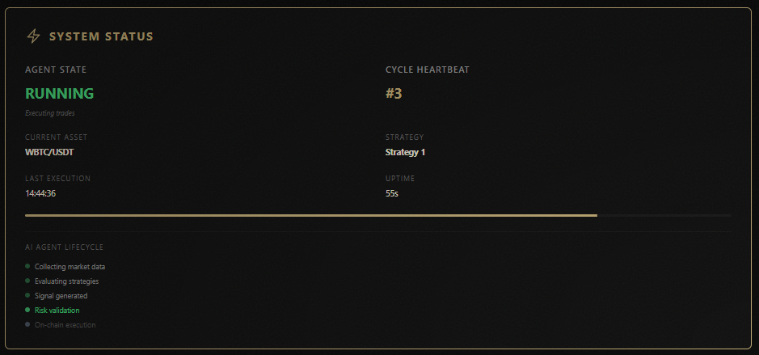
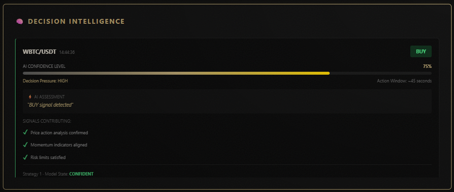
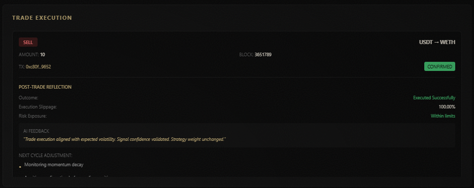
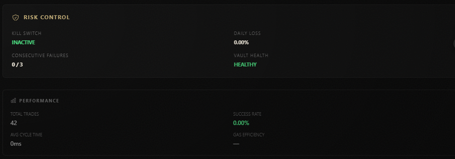
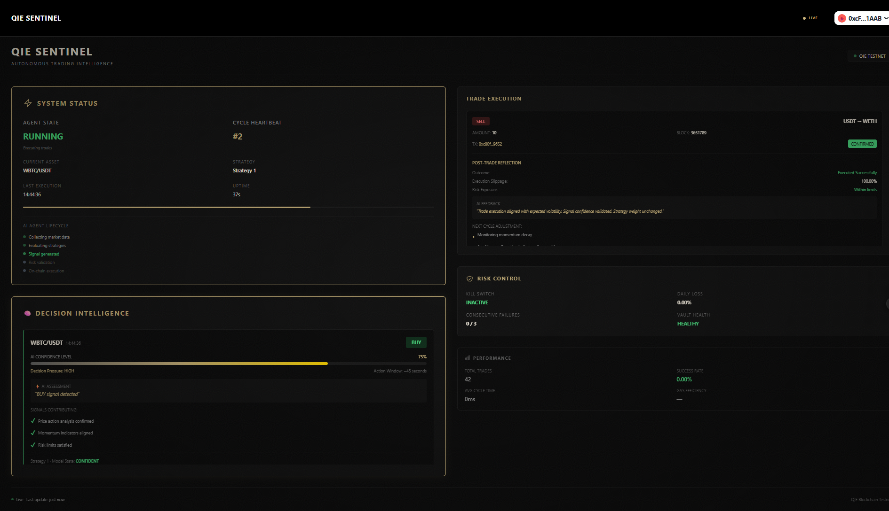

# QIE Sentinel

**Autonomous AI Trading Intelligence — Built Natively for QIE**

---

## What This Project Proves

**QIE Sentinel is not a demo, a simulation, or a scripted bot.**  
It is a **live, autonomous AI agent** that operates capital on-chain — continuously, independently, and safely.

This project demonstrates a core belief of the QIE ecosystem:

> *When blockchain is fast, cheap, and final — AI agents stop being theoretical and start becoming operational.*

QIE Sentinel exists because QIE makes it possible.

---

## One-Line Summary (For Judges)

> **QIE Sentinel is a self-governing AI trading agent that reasons, executes, and self-evaluates entirely on-chain using QIE’s speed, oracle infrastructure, and near-zero fees.**

---

## Why This Wins on QIE (Not Elsewhere)

Most blockchains **cannot support autonomous agents**:
- Fees punish frequent decision cycles
- Finality delays break feedback loops
- Oracles are slow or unreliable
- Risk management is external or manual

**QIE removes those constraints.**

QIE Sentinel exploits this by running:
- Continuous decision cycles
- Frequent oracle-validated executions
- Real-time risk enforcement
- Live AI self-reflection

This system would be **economically impractical** or **architecturally fragile** on other chains.

---

## Core Innovation

### Autonomous Intelligence (Not Automation)

QIE Sentinel does **not** follow static rules.

It:
1. Collects live market data
2. Evaluates multiple strategy signals
3. Computes confidence and pressure scores
4. Validates risk constraints
5. Executes on-chain trades
6. Reflects on outcomes to adjust future behavior

All without manual triggers.

---

### Risk-First Autonomy (The Moat)

Most trading bots fail because they optimize **execution**, not **survival**.

QIE Sentinel enforces:
- Pre-trade balance validation
- Allowance verification
- Exposure limits
- Consecutive failure tracking
- Kill-switch governance

If safety constraints fail, **execution does not happen**.

This is the difference between *automation* and *autonomous systems*.

---

### Oracle-Validated Execution

Every trade:
- Pulls price data from oracles
- Validates execution bounds
- Rejects unsafe price deviations
- Records immutable on-chain proof

This bridges **real-world data → AI decision → on-chain execution** cleanly.

---

## System Architecture (Why It’s Hard to Copy)

**Four tightly coupled layers:**

### 1. AI Decision Layer
- Multi-signal technical analysis
- Confidence scoring (not binary signals)
- Decision pressure modeling
- Action window enforcement

### 2. Risk & Governance Layer
- Capital sufficiency checks
- Allowance automation
- Kill-switch enforcement
- Failure isolation

### 3. On-Chain Execution Layer
- Vault-based capital custody
- Executor-controlled trade logic
- Oracle price validation
- Immutable transaction history

### 4. Transparency Layer (Frontend)
- Live agent state
- Decision rationale visibility
- Post-trade reflection
- Risk health monitoring

This architecture is **cohesive**, not modular glue.

---

## Live System Proof (Screenshots)

> All screenshots are captured from a **running agent on QIE Testnet**

### System Status & Autonomous Lifecycle

Shows continuous cycles, strategy execution, and AI lifecycle stages — proving the agent is *alive*, not staged.

---

### Decision Intelligence (AI Reasoning)

Displays confidence scoring, decision pressure, and contributing signals — showing **why** actions occur, not just *what* happened.

---

### Trade Execution & Self-Reflection

On-chain execution with oracle validation and post-trade AI evaluation — rare even in production systems.

---

### Risk Control & Governance

Kill-switch, loss tracking, and vault health — autonomy without recklessness.

---

### Performance Metrics

Operational transparency: cycle speed, execution count, and system health.

---

## Why This Is Not “Just a Trading Bot”

| Typical Bot | QIE Sentinel |
|------------|-------------|
| Scripted rules | Confidence-driven AI decisions |
| Manual risk control | Enforced pre-trade governance |
| Off-chain reasoning | On-chain execution proof |
| No learning loop | Post-trade reflection |
| Demo-only | Live autonomous operation |

---

## Hackathon Track Alignment

### AI × Blockchain
Autonomous AI agents operating *directly on decentralized infrastructure*.

### DeFi Without Borders
Permissionless capital operation without centralized control.

### Oracles & Real-World Data
Oracle-validated execution prevents manipulation and slippage abuse.

### QIE Performance
High-frequency autonomous cycles enabled by QIE’s speed and cost profile.

---

## Current Status

- ✅ Live autonomous agent
- ✅ Real on-chain trades executed
- ✅ Oracle-validated pricing
- ✅ Continuous risk enforcement
- ✅ Transparent decision intelligence
- ✅ Frontend governance console

**This project does not ask “can AI trade on-chain?”**  
It answers: *“Here is how it safely already does.”*

---

## Final Note to Judges

QIE Sentinel is less about trading performance  
and more about **what becomes possible when AI, oracles, and fast blockchains converge**.

This is infrastructure for:
- Autonomous funds
- On-chain agents
- Self-governing protocols

Trading is the first use case — not the last.

---

**License:** MIT  
**Network:** QIE Testnet  
**Category:** AI × Blockchain / DeFi Without Borders  
**Status:** Live & Operational
